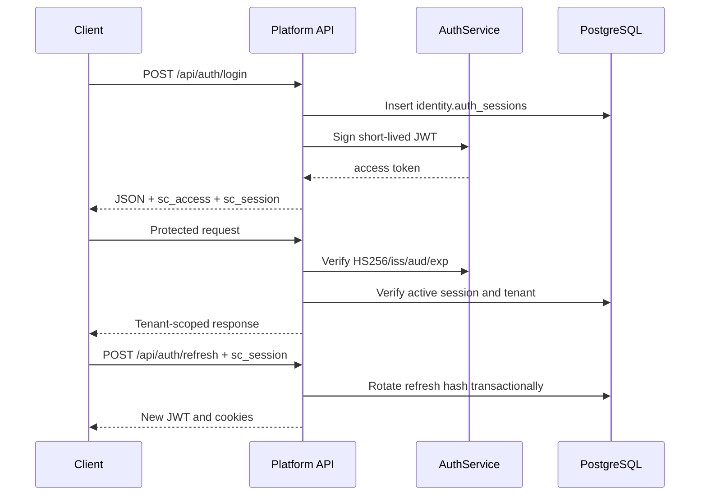

# SuperCampus Backend API

Implementation-synchronized documentation for the Rust backend as inspected on 31 July 2026.

## Coverage

The running `platform-api` mounts **76 operations**:

- 22 system, authentication, state, catalog, configuration, and dynamic-record operations.
- 54 CRM operations, including one WebSocket upgrade endpoint.
- 12 module packages are registered in the catalog, but only CRM has a mounted module-specific router.

The canonical implementation sources are:

- `apps/platform-api/src/routes.rs` and `state.rs`.
- `crates/authn/src/lib.rs`.
- `modules/crm/src/api`, `application`, `domain`, and `infrastructure/postgres`.
- `migrations/runtime/*.sql`.

Documentation never treats a manifest or placeholder OpenAPI file as proof that an HTTP endpoint exists.

## Servers

| Environment | Base URL |
|---|---|
| Local API | `http://localhost:4000` |
| Local CRM | `http://localhost:4000/api/v1/crm` |
| Local CRM WebSocket | `ws://localhost:4000/api/v1/crm/events?cursor=0` |
| Production | Not configured in this repository |

## Documentation map

| Document | Purpose |
|---|---|
| [Authentication](authentication.md) | JWT, cookies, refresh rotation, tenant context and login flows |
| [Errors](errors.md) | Actual response envelopes and implemented status codes |
| [Pagination](pagination.md) | Filtering, searching, ordering and limits |
| [Filtering](filtering.md) | CRM filter behavior and role scoping |
| [Sorting](sorting.md) | Fixed server ordering and unimplemented client sorts |
| [Search](search.md) | CRM search fields and limitations |
| [Request lifecycle](request-lifecycle.md) | Request/response sequence diagram |
| [Swagger and ReDoc](swagger.md) | Import and hosting status |
| [Rate limits](rate-limits.md) | Current absence of throttling and production requirements |
| [WebSockets](websockets.md) | CRM event stream contract |
| [Webhooks](webhooks.md) | Webhook implementation status |
| [Files](files.md) | Upload/download implementation status |
| [Versioning](versioning.md) | Version and deprecation policy |
| [Data model](data-model.md) | Database and tenant-isolation overview |
| [Auth module](modules/auth.md) | Every authentication endpoint |
| [Platform module](modules/platform.md) | Every platform endpoint |
| [CRM module](modules/crm.md) | Every CRM endpoint, validation and side effect |
| [Module status](modules/not-implemented.md) | HTTP features that are scaffolds or absent |
| [OpenAPI 3.1](openapi.yaml) | Swagger UI/ReDoc compatible machine contract |
| [Swagger JSON](swagger.json) | JSON form of the OpenAPI contract |
| [Postman collection](postman/SuperCampus.postman_collection.json) | Importable requests |
| [Postman environment](postman/SuperCampus.environment.json) | Local variables |
| [Changelog template](api-changelog-template.md) | API release template |

The existing [CRM response catalog](CRM_API_ENDPOINTS.md) contains expanded CRM response examples, while [database storage architecture](DATABASE_STORAGE_ARCHITECTURE.md) describes columns and operational queries.

## Quick start

1. Start `supercampus-platform-api`.
2. Call `POST /api/auth/login` with an active database-backed identity.
3. Save `data.accessToken`.
4. Send `Authorization: Bearer <token>` to protected APIs.
5. Refresh with the HTTP-only `sc_session` cookie.

Optional local/QA users are seeded only with `SEED_TEST_USERS=true` and `TEST_*`
environment variables. Password hashes and tenant roles are stored in PostgreSQL.

## Implementation status

| Capability | Status |
|---|---|
| HS256 JWT access tokens | Implemented |
| Server-side refresh sessions | Implemented |
| Database-backed password verification | Implemented |
| Tenant memberships and database-backed roles | Implemented |
| Refresh rotation and reuse revocation | Implemented |
| Tenant claim enforcement | Implemented |
| CRM role/ownership authorization | Implemented |
| Generic platform granular RBAC | Not Implemented |
| OAuth/OIDC | Not Implemented |
| API keys | Not Implemented |
| CSRF token middleware | Not Implemented; SameSite=Lax cookies are present |
| Rate limiting / 429 | Not Implemented |
| 422 response mapping | Not Implemented; validation uses 400 |
| Webhooks | Not Implemented |
| File upload/download HTTP API | Not Implemented |
| Response caching | Not Implemented |
| Swagger UI route hosted by backend | Not Implemented; generated spec is compatible |
| Background external notification delivery | Not Implemented |

## Authentication flow

## Common request rules

- JSON endpoints require `Content-Type: application/json`.
- Protected endpoints accept a bearer JWT or `sc_access` cookie.
- The middleware derives `x-tenant-id`, `x-user-id`, and `x-user-role` from the verified server session.
- A caller-provided `x-tenant-id` must match the JWT `tid` claim.
- CRM identifiers are UUIDs unless documented otherwise.
- Unknown JSON fields are currently accepted by Serde.
