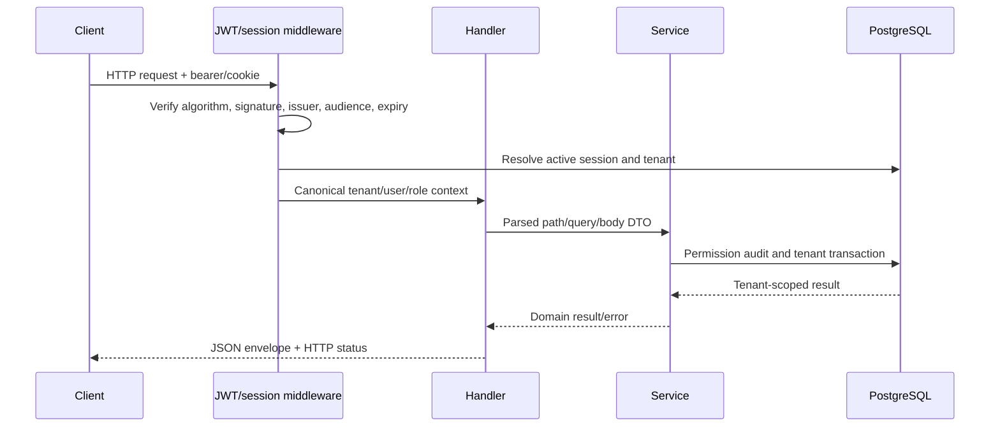

# Request and response lifecycle

For CRM writes, history, aggregate changes and outbox events are generally committed together. Form enquiry lead creation plus submission uses compensation rather than one cross-operation transaction. WebSocket requests upgrade after the same middleware and then poll tenant outbox events.
